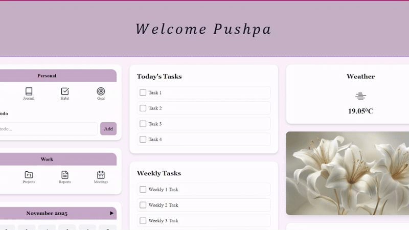

🌟 My-Dashboard — Personal & Work Productivity Manager

  

A modern, responsive, AI-assisted Productivity Dashboard built using
React (frontend) and Django REST Framework (backend).
It centralizes all your personal tasks, work tasks, goals, journals, notes, meetings, reports, projects, and calendar events — all in one organized place.

This project streamlines daily productivity with a clean UI, secure user authentication (JWT), and full CRUD capabilities.

🚀 Live Features Demo

✔ Personal To-Do, Journals, Habits & Goals

✔ Work tasks, work projects, work meetings & reports

✔ Daily & Weekly task widgets

✔ Calendar with event management

✔ Notes with editing & deletion

✔ Weather widget

✔ Motivational quote widget

✔ Fully authenticated dashboard

✔ All data stored in backend database (not localStorage)

✔ Smooth & clean UI built using TailwindCSS

🎯 Why This Project Is Valuable (Recruiter Perspective)

This project demonstrates your skill in:

💡 Full-stack development (React + Django REST)

💡 Modular frontend architecture

💡 Secure authentication (JWT)

💡 Reusable components & hooks

💡 REST API design & integration

💡 Clean UI/UX implementation

💡 CRUD operations with relational database

💡 Real-state synchronization between frontend & backend

It’s built exactly like a production-ready SaaS dashboard — highly impressive for resumes & interviews.

🛠️ Tech Stack

Frontend

React.js

Axios

React Router

Tailwind CSS

Lucide Icons

Backend

Django

Django REST Framework

Simple JWT Authentication

SQLite / PostgreSQL

Django Filters

CORS Headers

🔐 Authentication Flow

This project uses JWT authentication:

User logs in → receives accessToken + refreshToken

Tokens stored in localStorage

All API calls automatically include the JWT token

Token refresh system auto-generates new access tokens

Unauthorized requests are handled gracefully

📦 Key Features (Detailed)

🔸 1. Personal Section

Add To-Dos

Write Journals

Track Habits

Maintain Goals

Delete & Edit items

Each item saved per-user in backend

🔸 2. Work Section

Includes 4 structured work categories:

Work Tasks

Work Projects

Work Reports

Work Meetings

Each supports:

Add

Edit

Delete

Auto-refresh

🔸 3. Notes

Add quick notes

Edit inline (auto-updates database)

Delete instantly

Fully synced with backend

🔸 4. Calendar

Month navigation

Add event on selected date

View all events for a day

Delete events

Highlights dates with events

🔸 5. Widgets
🌤 Weather Widget

Real-time weather API

Displays temperature & icon

💬 Motivation Quote Widget

Fetches inspirational quotes

Auto-refreshes quote

⚙️ Installation & Setup

🔧 1. Clone Repository

git clone https://github.com/Pushpa2-ai/personal-dashboard.git

cd my-dashboard

🐍 2. Backend Setup (Django)

Create Virtual Environment

cd backend

python -m venv venv

venv\Scripts\activate   # Windows

Install Requirements

pip install -r requirements.txt

Run Migrations

python manage.py migrate

Start Backend Server

python manage.py runserver

⚛️ 3. Frontend Setup (React)

cd frontend

npm install

npm start

🔌 API Endpoints

Auth

POST /api/token/

POST /api/token/refresh/

Events (includes personal, work, calendar)

GET /api/events/

POST /api/events/

PUT /api/events/<id>/

DELETE /api/events/<id>/

Notes

GET /api/notes/

POST /api/notes/

PUT /api/notes/<id>/

DELETE /api/notes/<id>/

🎉 Future Enhancements

Dark mode

Analytics dashboard

Drag-and-drop calendar

Export notes & tasks

Multi-user collaboration

🤝 Contributing

Feel free to fork this repo, submit pull requests or open issues.

🙌 Author

Pushpa Kumari

👩‍💻 B.Tech (CSE-AIDS) | Full-Stack Developer

🔥 Passionate about building clean UI and scalable backend systems.
